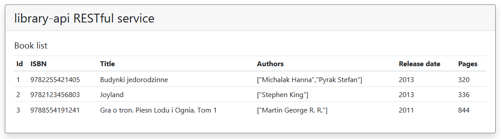

# REST_Library
RESTful service for book library. Small application to control books in the library. API allows adding, reading, updating and deleting books from memory database.

## RESTful service usage
Available methods for library-api service:
* GET /library-api/api/books - returns book list as JSON
* GET /library-api/api/books/{ISBN} - returns the book as JSON with given ISBN number on path param
* POST /library-api/api/books - adds to new book to the list
* PUT /library-api/api/books - updates the book with given ISBN number
* DELETE /library-api/api/books/{ISBN - deletes the book with given ISBN number on path param

## Front-End
Created simple page which displays table of books using [AngularJS](https://github.com/angular/angular.js) cotroller:

